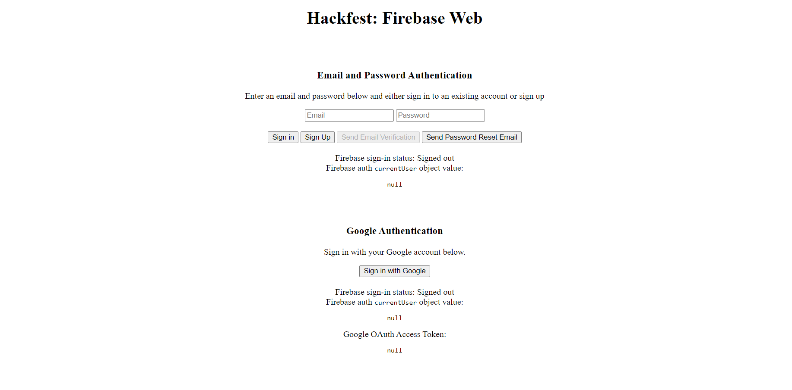

# Hackfest 2020: Firebase Web Project

Inspired and based from Firebase's Authentication Demo at [https://github.com/firebase/quickstart-js/tree/master/auth](https://github.com/firebase/quickstart-js/tree/master/auth).

## Expected Output

Accessible here:
[https://hackfest-workshop.web.app](https://hackfest-workshop.web.app).

<p align="center">
  
</p>

## Prerequisite

You need to have created a Firebase Project in the
[Firebase Console](https://firebase.google.com/console/) as well as configured a web app.

## Installation

Install the Firebase command line tool with `npm install -g firebase-tools` (See
[docs](https://firebase.google.com/docs/cli/#setup)).

Enable the Auth providers you would like to offer your users in the console, under
Auth > Sign-in methods.

Run:

```bash
git clone https://github.com/firebase/firebaseui-web.git
cd hf-firebase-web
```

This will clone the repository in the current directory.

## Server and Deploy

To run your firebase project locally, just run

```bash
firebase serve
```

This will compile all the files needed server locally at
[http://localhost:5000](http://localhost:5000).

To deploy, just run the code below

```bash
firebase deploy
```
